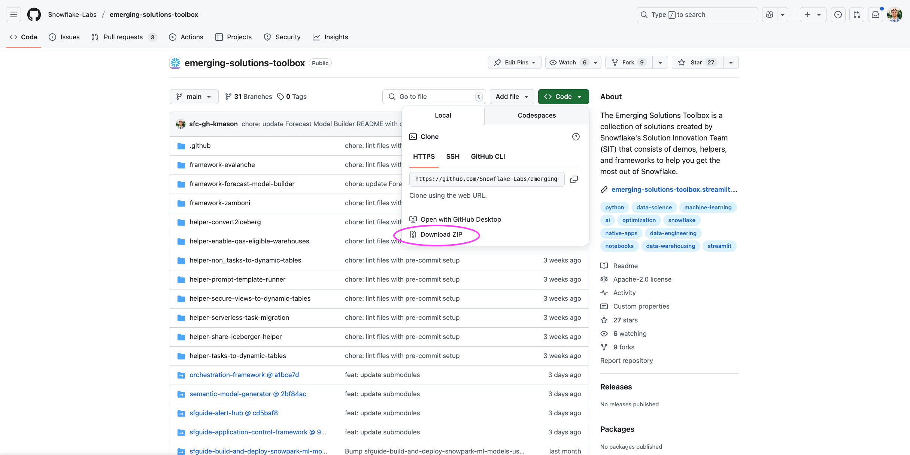
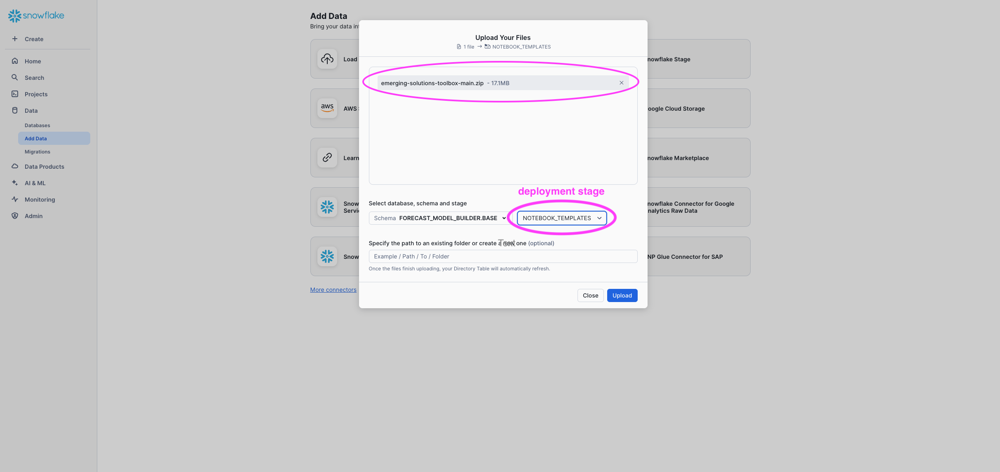

# Forecast Model Builder

Forecast Model Builder is a notebook-based solution that simplifies the process of training and deploying time-series forecast models in Snowflake.
[Click here](https://quickstarts.snowflake.com/guide/building_scalable_time_series_forecasting_models_on_snowflake/index.html#0) to walk through a Quickstart of the solution.
<br>
<br>


-----------------------------------------------

# Deployment Notebook Instructions

## Overview

FORECAST_MODEL_BUILDER_DEPLOYMENT.ipynb deploys the **Forecast Model Builder** solution into your **Snowflake** account. Several objects, including solution notebooks and a demo dataset, will be created. To get started download the [.ipynb file](https://github.com/Snowflake-Labs/emerging-solutions-toolbox/blob/main/framework-forecast-model-builder/FORECAST_MODEL_BUILDER_DEPLOYMENT.ipynb) from the repo and import the notebook into Snowsight. (For instructions on how to create a new Snowflake Notebook from an existing file, please see [this documentation](https://docs.snowflake.com/en/user-guide/ui-snowsight/notebooks-create#create-a-new-notebook) and follow the instructions for creating a notebook from an existing file.)

- In **Cell 1** of the deployment notebook you **establish the deployment settings**.  There are 4 user constants that can be set:
  - `DEPLOYMENT_WH`
  - `SOLUTION_DB`
  - `SOLUTION_BASE_SCHEMA`
  - `DEPLOYMENT_STAGE` <br>

- **Cell 2** will try to create the objects specified in the 4 user constants (if they do not already exist) and then prompt you to stage a zipped copy of the Emerging Solutions Toolbox or use a git integration.<br>
This cell will also store mock time series data in a Snowflake table named \<`SOLUTION_DB`\>.\<`SOLUTION_BASE_SCHEMA`\>.DAILY_PARTITIONED_SAMPLE_DATA.<br>

- In **Cell 3, you create a new project. It is recommended that each forecasting project have a dedicated schema. If your role has the privilege to create schemas on SOLUTION_DB**, this cell will automatically create a new schema for each new project name. In that schema, this cell creates three notebooks (eda, modeling, and inference).


## Instructions

The instructions vary depending on the privileges granted to the user running this deployment notebook. Follow the instructions that match your level of access.

### Option 1 (Fastest):
**If your role has privileges to CREATE DATABASE …**
1. In **Cell 1** you can leave the user constants set to their default values, and the notebook will create objects with the names established. It is fine to specify an already-existing warehouse to use instead of a new one to create. If your role does not have privileges to create a warehouse, then you must specify an existing one.
2. **Run Cell 2**. If the Emerging Solution Toolbox files have not already been deployed, you will be prompted to either stage the zip file or use a git integration. (To stage a zip file, see [File Staging Instructions](#file-staging-instructions) below.) Once everything is deployed, **re-run Cell 2**. You should see 4 check marks.
3. In the input box below **Cell 3**, name your forecasting project. **Run Cell 3**. This will create a project schema and the three notebooks in that schema.


### Option 2:
**If your role CANNOT have privileges to CREATE DATABASE but CAN be granted privileges to CREATE SCHEMA …**
1. Ask a Snowflake database administrator (DBA) to create or grant access to a **database** for the solution. It is easiest if the DBA can **GRANT OWNERSHIP** on that **database** to your role.
   ```sql
   CREATE DATABASE IF NOT EXISTS <SOLUTION_DB>;
   ```
   If your role cannot be granted ownership of the database, you will need the following privileges:
   ```sql
   GRANT USAGE ON DATABASE <SOLUTION_DB> TO ROLE <role>;
   GRANT CREATE SCHEMA ON DATABASE <SOLUTION_DB> TO ROLE <role>;
   ```
2. Outside of the deployment notebook, you need to create a **base schema** and **stage**. <br>
(You will list these object names in the SOLUTION_BASE_SCHEMA and DEPLOYMENT_STAGE constants in Cell 1.)
   ```sql
   CREATE SCHEMA <SOLUTION_DB>.<SOLUTION_BASE_SCHEMA>;
   CREATE STAGE <SOLUTION_DB>.<SOLUTION_BASE_SCHEMA>.<DEPLOYMENT_STAGE>;
   ```
3. In **Cell 1** specify this database, schema, and stage, and an existing warehouse for the four user constants. **Run Cell 1**.
4. **Run Cell 2**. If the Emerging Solution Toolbox files have not already been deployed, you will be prompted to either stage the zip file or use a git integration. (To stage a zip file, see [File Staging Instructions](#file-staging-instructions) below.) Once everything is deployed, **re-run Cell 2**. You should see 4 check marks.
5. In the input box below **Cell 3**, name your forecasting project. **Run Cell 3**. This will create a project schema and the three notebooks in that schema.

### Option 3:
**If your role CANNOT have privileges to CREATE SCHEMA …**

If your role has not been granted the privilege to CREATE SCHEMA on an existing database, you must use existing schemas for each new project.

NOTE: Caution must be applied when using this approach. This deployment notebook tries to create new solution notebooks for each new forecasting project, but it will not be able to create future project notebooks if ones with the same names already exist in the specified schema. Additionally, the solution notebooks create tables, and the user must be careful not to give future models the same names as past models. For this reason, it is **highly recommended that each forecasting project be given its own schema**.

1. A database, solution base schema, solution base stage, and project schema are required. If not available, ask a Snowflake database administrator (DBA) to create or grant access to the following objects:
   ```sql
   CREATE DATABASE IF NOT EXISTS <SOLUTION_DB>;
   CREATE SCHEMA IF NOT EXISTS <SOLUTION_DB>.<SOLUTION_BASE_SCHEMA>;
   CREATE STAGE IF NOT EXISTS <SOLUTION_DB>.<SOLUTION_BASE_SCHEMA>.<DEPLOYMENT_STAGE>;
   CREATE SCHEMA IF NOT EXISTS <SOLUTION_DB>.<PROJECT_SCHEMA>;
   ```
2. Your role will need the following privileges granted by a DBA:
   ```sql
   GRANT USAGE ON DATABASE <SOLUTION_DB> TO ROLE <role>;

   -- Solution Base Schema
   GRANT USAGE ON SCHEMA <SOLUTION_DB>.<SOLUTION_BASE_SCHEMA> TO ROLE <role>;
   GRANT CREATE TABLE ON SCHEMA <SOLUTION_DB>.<SOLUTION_BASE_SCHEMA> TO ROLE <role>;
   GRANT CREATE FILE FORMAT ON SCHEMA <SOLUTION_DB>.<SOLUTION_BASE_SCHEMA> TO ROLE <role>;
   GRANT CREATE PROCEDURE ON SCHEMA <SOLUTION_DB>.<SOLUTION_BASE_SCHEMA> TO ROLE <role>;
   GRANT SELECT ON FUTURE TABLES IN SCHEMA <SOLUTION_DB>.<SOLUTION_BASE_SCHEMA> TO ROLE <role>;
   GRANT SELECT ON FUTURE VIEWS IN SCHEMA <SOLUTION_DB>.<SOLUTION_BASE_SCHEMA> TO ROLE <role>;
   GRANT USAGE ON FUTURE FUNCTIONS IN SCHEMA <SOLUTION_DB>.<SOLUTION_BASE_SCHEMA> TO ROLE <role>;
   GRANT USAGE ON FUTURE PROCEDURES IN SCHEMA <SOLUTION_DB>.<SOLUTION_BASE_SCHEMA> TO ROLE <role>;

   -- Deployment Stage
   GRANT READ, WRITE ON STAGE <SOLUTION_DB>.<SOLUTION_BASE_SCHEMA>.<DEPLOYMENT_STAGE> TO ROLE <role>;

   -- Project Schema
   GRANT USAGE ON SCHEMA <SOLUTION_DB>.<PROJECT_SCHEMA> TO ROLE <role>;
   GRANT CREATE NOTEBOOK ON SCHEMA <SOLUTION_DB>.<PROJECT_SCHEMA> TO ROLE <role>;
   GRANT CREATE TABLE ON SCHEMA <SOLUTION_DB>.<PROJECT_SCHEMA> TO ROLE <role>;
   GRANT CREATE FUNCTION ON SCHEMA <SOLUTION_DB>.<PROJECT_SCHEMA> TO ROLE <role>;
   GRANT CREATE MODEL ON SCHEMA <SOLUTION_DB>.<PROJECT_SCHEMA> TO ROLE <role>;
   GRANT USAGE ON FUTURE FUNCTIONS IN SCHEMA <SOLUTION_DB>.<PROJECT_SCHEMA> TO ROLE <role>;
   GRANT USAGE ON FUTURE MODELS IN SCHEMA <SOLUTION_DB>.<PROJECT_SCHEMA> TO ROLE <role>;
   ```
3. In **Cell 1** of the deployment notebook, specify an existing warehouse, database, schema, and stage for the four user constants. **Run Cell 1**.
4. In **Cell 2**, open the code and comment out this line near the bottom:
   ```python
   session.sql(create_schema_sql).collect()
   ```
5. **Run Cell 2**. If the Emerging Solution Toolbox files have not already been deployed, you will be prompted to either stage the zip file or use a git integration. (To stage a zip file, see [File Staging Instructions](#file-staging-instructions) below.) Once everything is deployed, **re-run Cell 2**. You should see 4 check marks.
6. In the input box below **Cell 3**, choose an existing schema name as your project name (e.g.\<`PROJECT_SCHEMA`\>). <br>
**NOTE:** You must choose a different schema than the one specified in the `SOLUTION_BASE_SCHEMA` constant.
7. **Run Cell 3**. This will create the 3 notebooks in the schema you specified. <br>
REMINDER: if you specify the same schema for a future project, this cell will not be able to create new solution notebooks if you haven’t renamed the old notebooks in that schema.

<br>

-----------------------------------------------

# File Staging Instructions

If you choose to stage a zip file when prompted by Cell 2 of the deployment notebook, follow these steps:

1. Download a zipped file of the entire [Emerging Solutions Toolbox](https://github.com/Snowflake-Labs/emerging-solutions-toolbox) GitHub repository.


2. Upload the zip file to \<`DEPLOYMENT_STAGE`\>.


<br>

-----------------------------------------------

## Support Notice
All sample code is provided for reference purposes only. Please note that this code is provided “AS IS” and without warranty.  Snowflake will not offer any support for use of the sample code.

Copyright (c) 2025 Snowflake Inc. All Rights Reserved.

Please see TAGGING.md for details on object comments.
