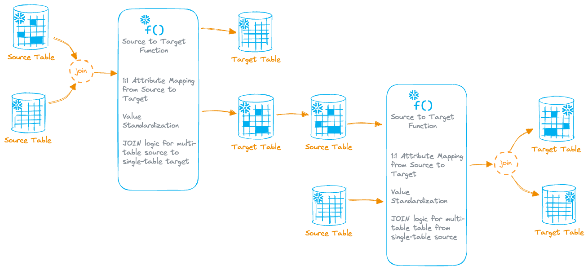

# Zamboni v1.0

Zamboni allows a customer to create a pipeline of Source-to-Target transformations with little to no ELT engineering required.  The framework is built to allow customers to choose a source and map attributes to a specific target layout, including simple data transformations.

## Reference Architecture

## Documentation

 - For Zamboni's detailed design, please refer to the Zamboni Detailed Design document in the `docs/` folder for more details.
 - For example JSON payloads of Zamboni metadata, refer to the `sample_json_payloads` folder.

## Deployment

### Step 1: Setup Process
The framework is set up by executing the following scripts in a Snowsight worksheet or an IDE of choice:

1. setup/01_zamboni_role_setup.sql (replace `<USER_NAME>` with the applicable user name)
2. setup/02_zamboni_metadata.sql
3. setup/03_zamboni_load_process_types.sql
4. setup/04_zamboni_create_procs.sql

### Step 2: Demo
Zamboni includes sample data, along with an end-to-end demo script that shows the entire pipeline process, from creating source/target collections, to orchestrating multiple process executions and running them.  Run the following scripts in a Snowsight worksheet or an IDE of choice:

1. demo/01_zamboni_create_sample_data.sql
2. demo/02_zamboni_demo.sql

## Consumption Tracking
Comments have been added to key framework objects to track Snowflake credit consumption of applications built using the Application Control Framework.  **Please do not remove or modify comments**.  Any modifications could result in the ability to properly track consumption.

---

## Support Notice
All sample code is provided for reference purposes only. Please note that this code is provided “AS IS” and without warranty.  Snowflake will not offer any support for use of the sample code.

Copyright (c) 2024 Snowflake Inc. All Rights Reserved.

The purpose of the code is to provide customers with easy access to innovative ideas that have been built to accelerate customers' adoption of key Snowflake features.  We certainly look for customers' feedback on these solutions and will be updating features, fixing bugs, and releasing new solutions on a regular basis.

Please see TAGGING.md for details on object comments.