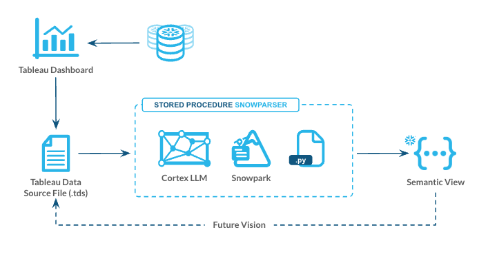
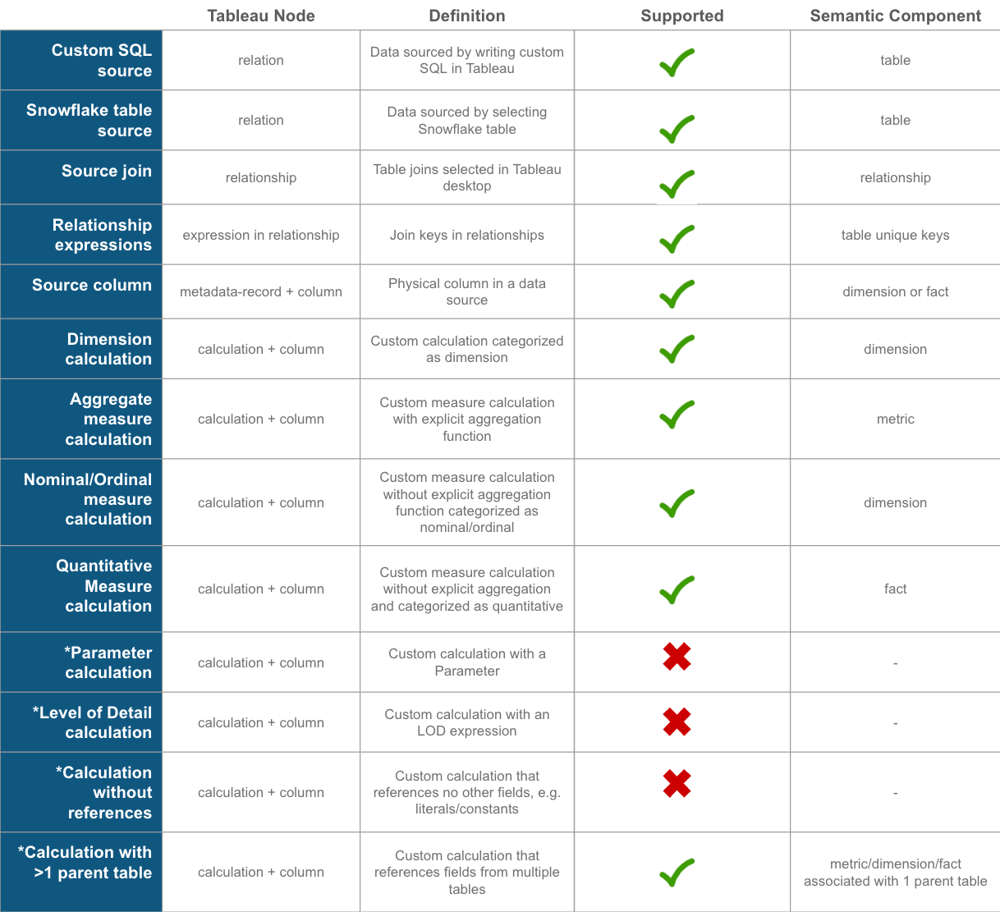

## Snowparser
Snowparser is a Helper created by Snowflake’s Solution Innovation Team (SIT).

## Support Notice
All sample code is provided for reference purposes only. Please note that this code is provided `as is` and without warranty. Snowflake will not offer any support for the use of the sample code.

## Copyright Notice
Copyright (c) [Current Year] Snowflake Inc. All Rights Reserved.

## Purpose
The purpose of the code is to provide customers with easy access to innovative ideas that have been built to accelerate customers' adoption of key Snowflake features. We certainly look for customers' feedback on these solutions and will be updating features, fixing bugs, and releasing new solutions on a regular basis.

## Tagging
Please see `TAGGING.md` for details on object comments.

## Overview
Snowparser enables Snowflake users to generate native [Snowflake semantic views](https://docs.snowflake.com/LIMITEDACCESS/semantic-views/overview) from existing [Tableau data source files](https://help.tableau.com/current/pro/desktop/en-us/export_connection.htm).  The Snowparser utility is operationalized via a Snowflake Stored Procedure and callable via SQL or Python API.

Snowparser accepts 2 arguments:
- `tableau_data_source_file`: The location of the Tableau data source (.tds) file.
- `view_name`: The desired name of the Snowflake Semantic View

The `tableau_data_source_file` should be a path to a .tds file in Snowflake stage, e.g. `@JSUMMER.PUBLIC.DROPBOX/TPCDS_Model_REVISED.tds`. `view_name` can be a fully qualified name with database and schema or the current database and schema will be used. The utility will replace any semantic view of the same name if a name is re-used.

## Prerequisites
To utilize Snowparser, please take note of the following requirements.

- Your Snowflake account must be enabled for [Semantic Views](https://docs.snowflake.com/user-guide/views-semantic/overview).
- The Tableau data source must not have nor reference any extracts. To remove extracts completely, first switch the data source to a live connection. Then remove references to the extract(s) as described in the 'Remove the extract from the workbook' section in [Tableau documentation](https://help.tableau.com/current/pro/desktop/en-us/extracting_data.htm).
- Semantic View relationships currently support many-to-1 relationships. It is recommended to denote unique keys in Tableau using [Performance Options](https://help.tableau.com/current/pro/desktop/en-us/datasource_relationships_perfoptions.htm) in Tableau Desktop.
- A [Tableau Data Source file (.tds)]((https://help.tableau.com/current/pro/desktop/en-us/export_connection.htm)) must be obtained from Tableau Desktop and uploaded to Snowflake stage.

## Setup
> Note: Deployment requires `ACCOUNTADMIN` to create API integrations.
Snowparser as a Stored Procedure can be registered directly by using Snowflake's git integration. Below are a couple options to do so.

### Snowsight Worksheet
Copy and paste the contents of `register.sql` into a Snowsight SQL Worksheet.
Ensure your context role is appropriate as this will be the owning role of the corresponding objects.
Execute the entire SQL Worksheet.

### VSCode with Snowflake Extension
See [Snowflake Extension for Visual Studio Code installation documentation](https://docs.snowflake.com/en/user-guide/vscode-ext) for instructions. Once installed, sign into Snowflake in the extension. Execute all of `register.sql` from VSCode. Ensure your context role is appropriate as this will be the owning role of the corresponding objects.

## Executing
Below is an example of creating a Semantic View directly from the Tableau data source file.

```sql
-- Runs CREATE OR REPLACE DDL for create Semantic View
CALL GENAI_UTILITIES.UTILITIES.SNOWPARSER_CREATE_SEMANTIC(
    tableau_data_source_file => '@JSUMMER.PUBLIC.DROPBOX/TPCDS_Model_REVISED.tds',
    view_name => 'MY_SEMANTIC_VIEW',
    create_views => TRUE -- Default is True so can omit
    );
```

There is an additional helper Stored Procedure to generate the DDL for the semantic view without executing it:
```sql
-- Returns DDL to create Semantic View
CALL GENAI_UTILITIES.UTILITIES.SNOWPARSER_SEMANTIC_DDL(
    tableau_data_source_file => '@JSUMMER.PUBLIC.DROPBOX/TPCDS_Model_REVISED.tds',
    view_name => 'MY_SEMANTIC_VIEW',
    create_views => TRUE -- Default is True so can omit
    );
```
**This will return an OBJECT response with keys `ddl` that contains the DDL for the semantic view and `orphans` which contains elements that were not successfully translated in the semantic view. Each orphaned element will have an explanation.**

If you prefer to not create views for custom SQL Tableau sources, set create_views to False.

There is also a utility function to simply extract the Snowflake tables and columns referenced in a Tableau data source.

```sql
-- Returns JSON of tables and columns
CALL GENAI_UTILITIES.UTILITIES.SNOWPARSER_GET_OBJECTS(
    tableau_data_source_file => '@JSUMMER.PUBLIC.DROPBOX/TPCDS_Model_REVISED.tds',
    create_views => False, -- Default is False so can omit
    defer_conversion => True -- Skips rest of processing beyond object extraction
    );
```

The below example Python implementation shows how Snowparser source can be used outside of a Snowflake Stored Procedure.

```python
from tableau import *

session = Session.builder.configs(...).create()
session.use_database("JSUMMER")
session.use_schema("SAMPLE_DATA")

tds_file = "samples/TPCDS_Model_REVISED.tds"
tableau_model = TableauTDS(tds_file, session)

result = tableau_model.get_view_ddl('MY_SEMANTIC_VIEW')
print(result['ddl'])

tableau_model.create_view('MY_SEMANTIC_VIEW')
```


## Reference Architecture


## Supported Components
We continue to add support for additional capabilities in the Snowflake Semantic View.
Below is a mapping of the supported and explicitly not supported aspects of Tableau features in the Semantic View. Any orphaned elements will be included in the returned object with explanations.


## Feedback
Please add issues to GitHub or email Jason Summer (jason.summer@snowflake.com).
