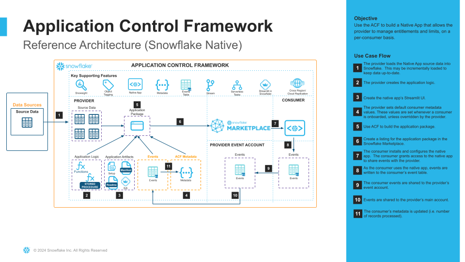

# Application Control Framework v1.7

Snowflake’s Application Control Framework (ACF) is a framework that allows an application developer (Provider) to integrate their existing application logic (already on Snowflake), with minimal/no modification, into a Snowflake Native App.

The ACF has pre-built controls which allows the Provider to monitor and control application usage, for each Consumer.

In addition, the Provider can control which function(s)/stored procedure(s) the Consumer can access within the application. The function(s)/stored procedure(s) will remain hidden from the Consumer, but accessible by the application.

## Reference Architecture


## Prerequisites:
- Download and install the latest version of SnowSQL (**if modifying the AS-IS deployment code**).
- The Provider must accept the Snowflake Marketplace Provider Terms of Service.
- The Consumer must accept the Snowflake Marketplace Consumer Terms of Service.
- The Provider must create an account that stores their native app and Application Control Framework objects.
- The Provider must create an account in each cloud region their native app will be available in. This account is used to collect events from consumer apps in each region. Events from this account are routed to the native app/ACF account via private data listings.
  - Once this account is created, the Provider will set it as the event account for the cloud region, by executing the following in the Snowflake Organization account, as ```ORGADMIN```
    - ```CALL SYSTEM$SET_EVENT_SHARING_ACCOUNT_FOR_REGION('<REGION>', 'PUBLIC', '<ACCOUNT_NAME>');```
      - The account region can be found by executing ```SELECT CURRENT_REGION();```
      - The account name can be found by executing ```SELECT CURRENT_ACCOUNT_NAME();```
    - ```CALL SYSTEM$ENABLE_GLOBAL_DATA_SHARING_FOR_ACCOUNT('<ACCOUNT_NAME>');```
      - The account name can be found by executing ```SELECT CURRENT_ACCOUNT_NAME();```
- The user that will execute the scripts in each account must have either the ```ACCOUNTADMIN``` role granted or a role that can create roles and manage grants on the account to other roles.

## AS-IS (out-of-the-box) Deployment
This repo includes three notebooks, located in the `installer/` directory, that streamline deploying the current version of the ACF. Each notebook should be imported in the appicable Snowflake account and executed, using the role specified. Refer to each notebook for more details. 

**NOTE:** each notebook is standalone and always references the latest ACF version. This allows the notebooks to be distributed separately from the full ACF repo.
- `01_event_account_setup`: this notebook configures a Snowflake account as an event account that collects events from native apps installed in that account's Snowflake cloud/region. A listing is created to share events from this region to the ACF account. If the native app will be available in multiple regions, this notebook should be executed in a Snowflake account in each applicable region.
- `02_acf_installer`: this notebook installs the ACF in the designated account, mounts databases for each event account listing, and creates the dev environment used to create/test the application logic
- `03_create_demo_native_app` (optional): this notebook deploys sample application logic, along with a Streamlit UI that can be used to build and deploy a native app that uses ACF to control and monitor usage.

## Custom Development Deployment
In the event developers want to modify/extend ACF functionality, this repo can be forked to deploy/test their updates, using SnowSQL. For more information, refer to the **Application Control Framework - Deployment Guide** document.
