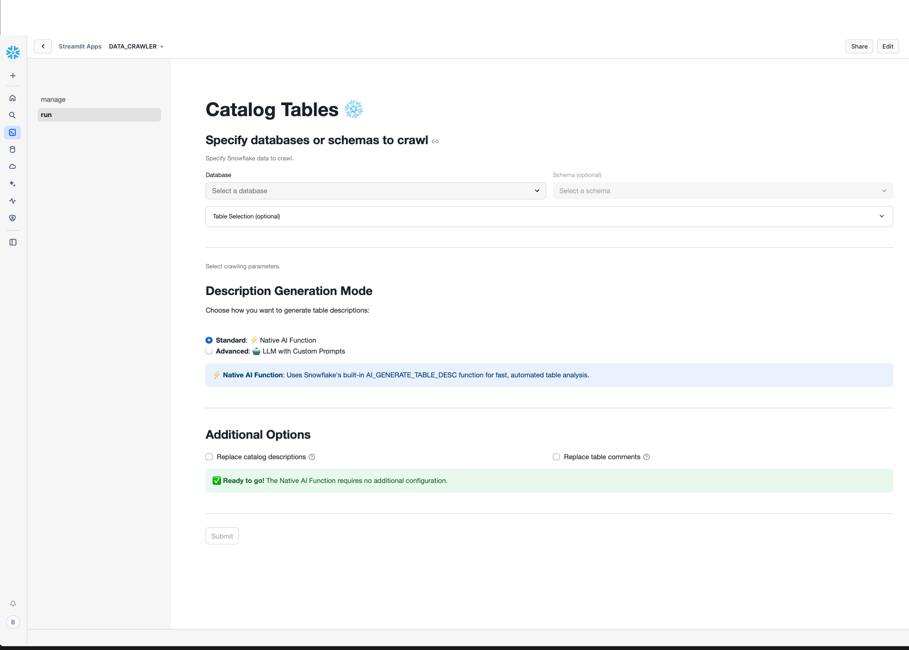

# Data Crawler Overview

<a href="https://emerging-solutions-toolbox.streamlit.app/">
    
</a>

The Data Crawler utility is a Snowflake stored procedure that prompts a Cortex Large Language Model (LLM) to generate a natural language description of each table contained in a Snowflake database and/or schema. The output of the utility are catalog table(s) containing natural language summaries of tables' contents which can be easily searched, reviewed, revised and searched by team members.

## Description Generation Modes

The Data Crawler offers two distinct modes for generating table descriptions:

### Standard Mode
- Uses Snowflake's built-in [`AI_GENERATE_TABLE_DESC`](https://docs.snowflake.com/en/sql-reference/stored-procedures/ai_generate_table_desc) function
- Requires no additional configuration

### Advanced Mode
- Offers customizable parameters:
  - Sampling strategy (fast/nonnull)
  - Number of sample rows (1-10)
  - Choice of Cortex LLM model

## Support Notice

All sample code is provided for reference purposes only. Please note that this code is
provided `as is` and without warranty. Snowflake will not offer any support for the use
of the sample code. The purpose of the code is to provide customers with easy access to
innovative ideas that have been built to accelerate customers' adoption of key
Snowflake features. We certainly look for customers' feedback on these solutions and
will be updating features, fixing bugs, and releasing new solutions on a regular basis.

Copyright (c) 2025 Snowflake Inc. All Rights Reserved.

## Data

Prompts passed to the LLM include a given Snowflake table’s database name, schema name, table name, column names, table comment (if available and specified by user), and a sample of table data. Tables in databases or schemas can be crawled. When crawling a user-specified database or schema, all tables and views readable to the current user’s role executing the utility will be included. Table viewing follows standard Snowflake Role Based Access Control.

## AI Security

Snowflake hosts and/or manages three types of large language models that power its AI Features: its own proprietary LLMs, open-source LLMs, and licensed proprietary LLMs (collectively, “LLMs”). Snowflake’s AI Features are subject to Snowflake’s standard shared responsibility model for data protection, governance, and security. Snowflake understands that trust is the foundation of its customer relationships and is committed to maintaining high standards of data security and privacy.

## Cortex LLMs
Snowflake Cortex gives you instant access to industry-leading large language models (LLMs) trained by researchers at companies like Mistral, Meta, and Google. It also offers models that Snowflake has fine-tuned for specific use cases. Since these LLMs are fully hosted and managed by Snowflake, using them requires no setup. Your data stays within Snowflake, giving you the performance, scalability, and governance you expect.

# Running Data Crawler
## Setup

### Prerequisites
Before deploying the Data Crawler, ensure that an ACCOUNTADMIN has granted the necessary session permissions by running:
```sql
GRANT READ SESSION ON ACCOUNT TO ROLE <ROLE_NAME>;
```

To refresh model objects, ensure that an ACCOUNTADMIN runs the [REFRESH](https://docs.snowflake.com/user-guide/snowflake-cortex/aisql?lang=de%2F#refresh-model-objects-and-application-roles) command:

```sql
CALL SNOWFLAKE.MODELS.CORTEX_BASE_MODELS_REFRESH();
```

### Deployment
The Data Crawler application is deployed to Streamlit in Snowflake by running the SQL file `setup.sql`. The file contents can be copied and pasted into a Snowsight SQL worksheet or run via [VSCode](https://docs.snowflake.com/en/user-guide/vscode-ext) with the Snowflake extension or [SnowCLI](https://docs.snowflake.com/en/developer-guide/snowflake-cli-v2/index). Once the file is run, the application is available in Snowsight via the Streamlit menu.

## Calling
All necessary functions and stored procedures are now registered in `DATA_CATALOG.TABLE_CATALOG` in Snowflake.
Any desired database and/or schema available to the current user/role can be crawled.

Below is an example of calling the utility to crawl all tables and views in database `JSUMMER` schema `CATALOG`. Results will be written to table `DATA_CATALOG.TABLE_CATALOGTABLE_CATALOG`.
```sql
CALL DATA_CATALOG.TABLE_CATALOG.DATA_CATALOG(target_database => 'JSUMMER',
                                  catalog_database => 'DATA_CATALOG',
                                  catalog_schema => 'TABLE_CATALOG',
                                  catalog_table => 'TABLE_CATALOG',
                                  target_schema => 'CATALOG',
                                  sampling_mode => 'fast',
                                  update_comment => FALSE,
                                  use_native_feature => FALSE
                                  );
```

Below is an example of calling the utility when Snowflake's native table description feature (when use_native_feature is set to True):

```sql
CALL DATA_CATALOG.TABLE_CATALOG.DATA_CATALOG(target_database => 'JSUMMER',
                                  catalog_database => 'DATA_CATALOG',
                                  catalog_schema => 'TABLE_CATALOG',
                                  catalog_table => 'TABLE_CATALOG',
                                  target_schema => 'CATALOG',
                                  update_comment => FALSE,
                                  use_native_feature => TRUE
                                  );
```
> **Note:** Depending on your security practices, you may need to grant usage on the database, schema, and/or stored procedure to others.

The stored procedure provides a number of parameters:
| parameter        | description |
| ------------     | ----------- |
| target_database  | Snowflake database to catalog.
| catalog_database | Snowflake database to store table catalog.
| catalog_schema   | Snowflake schemaname to store table catalog.
| catalog_table  | Snowflake tablename to store table catalog.
| target_schema | Snowflake schema to catalog. (Optional)
| include_tables   | Explicit list of tables to include in catalog. (Optional)
| exclude_tables  | Explicit list of tables to exclude in catalog. include_tables takes precedence over exclude_tables. (Optional)
| replace_catalog | If True, replace existing catalog table records. Defaults to False.
| sampling_mode   | How to retrieve sample data records for table. One of ['fast' (Default), 'nonnull']. Passing 'nonnull' will take considerably longer to run.
| update_comment  | If True, update table's current comments. Defaults to False.
| n | Number of records to sample from table. Defaults to 5.
| model   | Cortex model to generate table descriptions. Defaults to 'mistral-7b'.
| use_native_feature   | If True, uses Snowflake's AI_GENERATE_TABLE_DESC stored procedure to generate descriptions. Defaults to False.

## Streamlit UI
manage                |  run
:--------------------:|:-------------------------:
|

The final script creates a simple Streamlit user interface, `Data Crawler` with 2 pages:
- `manage`: Search, review, and revise any table descriptions.
- `run`: Specify a new database and/or schema to crawl.

The search feature on the `manage` page is a semantic search based on vector embeddings. Tables descriptions will be listed according to their semantic similarity to the text searched.

## Feedback

Feedback welcome. Reach out to jason.summer@snowflake.com.

## Tagging

Please see `TAGGING.md` for details on object comments.
