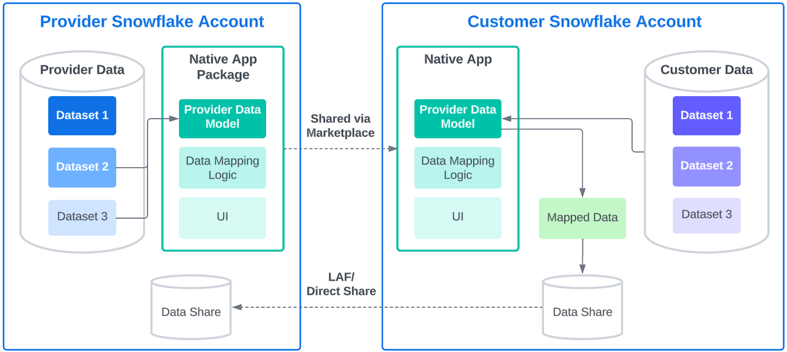

# Data Model Mapper 

 

The Data Model Mapper application helps providers get conformed data from partners at scale, from any cloud/region.  It provides a Streamlit UI that enables business users to model, map, and share their data to a provider's data specification, all without SQL and without needing to be a data engineer.

## Core Problem Solved

This solution addresses the common challenge of ingesting data from multiple partners who use disparate data formats. It provides a standardized approach for data definition by providers and data mapping by consumers.

## Overview
In the provided data_model_mapper notebook, we have constructed a single-account, end-to-end example using a supply chain use case.  Imagine a product distributor needing to manage inventory at a number of stores.  If every store has their own data model, that can present a significant data engineering challenge to create and manage all of the pipelines.  With the Data Model Mapper solves this by helping each store's business users model, map, and share their data with the provider, with the data matching the provider's specification.

The consumer gets an easy tool to help get their data shared, and the provider gets data in the same format from all of their consumers.

## Comprised of:

1.  **Provider Admin Application :** A Streamlit UI for Data Providers to define target data in their Snowflake environment.
2.  **Consumer Mapping Native App :** A Snowflake Native App, built by the Provider, which Data Consumers install. This app provides the UI for mapping.

**Note:** If using the the included demo data provided inside the app, the instalation procedure is condenced (below). It may be beneficial to start here for a basic understanding of how the applications work together. `The Complete Workflow Deployment Overview` section would still be relevant to read and understand, and is what you would want to focus on before rolling the application into a more production ready environment.

## Quick Installation Summary (with included demo data)

#### Consumer application
1. Import the `data_model_mapper.ipynb` notebook into your Snowflake environment
2. Hit Run All
3. Open the DATA_MODEL_MAPPER_APP from the Apps window in Snowsight and follow directions

**Note:** Once installed, the Data Model Mapper application will have populated demo data you can map towards. The Target administration streamlit application (instruction below) is optional if using the provided demo data.

#### Target Administration Streamlit application
1. Import `toprovider/data_model_mapper_admin_installer.ipynb` into your Snowflake environment
2. Hit Run All
3. Open the DATA_MODEL_MAPPER_ADMIN streamlit application from streamlit window in Snowsight and follow directions

## Installation and Usage Summary (for use without provided demo data)

### Data Provider Steps:

1.  **Setup Streamlit admin application and dependencies:** Run `toprovider/data_model_mapper_admin_installer.ipynb`.
2.  **Define Targets:** Use the installed streamlit application named `DATA_MODEL_MAPPER_ADMIN` inside snowsight to create target models in your admin DB.
2.  **Setup Consumer Native application** Follow the Consumer App Setup instructions inside the `DATA_MODEL_MAPPER_ADMIN` streamlit application.

### Data Consumer Steps:

1.  **Install Native App:** Install the `DATA_MODEL_MAPPER_APP` from your provider (if shared), or by following the steps below.
2.  **Run Setup Notebook:** Execute the `data_model_mapper.ipynb` notebook provided by your provider. This will:
    *   Guide you to connect to the provider's shared target definitions.
    *   Help you prepare your source data tables.
    *   Grant permissions to the installed app.
3.  **Use Mapping App:** Launch the installed `DATA_MODEL_MAPPER_APP`.
    *   The app will display the provider's target models.
    *   Map your prepared source data to these targets.
    *   Validate and share the conformed data.

## Complete Workflow Deployment Overview

**Phase 1: Data Provider - Define and Share Target Data Models**

1.  **Setup Provider Admin Environment (One-time):**
    *   The Provider runs `toprovider/data_model_mapper_admin_installer.ipynb` to create an admin database (e.g., `DATA_MODEL_MAPPER_ADMIN_APP`) for storing master target definitions.
2.  **Define Target Models:**
    *   Using the `DATA_MODEL_MAPPER_ADMIN` streamlit application, the Provider creates "Target Collections" (logical data models), "Target Entities" (tables), and "Target Entity Attributes" (columns). These are saved in the applications `DATA_MODEL_MAPPER_ADMIN_APP.admin` schema.
3.  **Publish Target Definitions & Package Consumer Native App:**
    *   **Publish Targets:** The Provider uses these definitions and provides them to the consumer app installer notebook `data_model_mapper.ipynb`
    *   **Package Consumer App:** The Provider packages the Consumer Mapping Application (Streamlit app in `toStage/streamlit/`) into a Snowflake Native Application package. This package is configured to read target definitions created from the `DATA_MODEL_MAPPER_ADMIN` streamlit app.
    *   **Distribute:** The Provider lists this Native App package on the Snowflake Marketplace or shares `data_model_mapper.ipynb` directly with consumers.

**Phase 2: Data Consumer - Setup, Map, and Share Data**

1.  **Install Consumer Mapping Native App:**
    *   The Consumer installs the `DATA_MODEL_MAPPER_APP` from the provider's Marketplace listing, direct share, or uses the provider supplied `data_model_mapper.ipynb`
2.  **Initial Environment & Data Setup (Using `data_model_mapper.ipynb`):**
    *   The Consumer runs the `data_model_mapper.ipynb` notebook in their own Snowflake environment. This notebook guides them to:
        *   Reference the **Provider's Shared definitions** that contains the target data model definitions.
        *   Identify and prepare their own source data tables for mapping.
        *   Grant necessary permissions from their source data tables to the installed `DATA_MODEL_MAPPER_APP`.
        *   Create local helper tables in their account (e.g., for staging, storing mapping configurations, or caching target definitions accessed via the share). *The notebook create tables like `target_collection`, `target_entity` in the consumer's account for these purposes.*
3.  **Map Data Using the Installed Native App:**
    *   The Consumer launches the installed `DATA_MODEL_MAPPER_APP` from the "Apps" section in Snowsight.
    *   The app's UI (`toStage/streamlit/data_modeler.py`):
        *   Reads the provider target definitions 
        *   Provides tools for visual mapping of source columns to target attributes, defining joins, etc.
4.  **Validate and Share Conformed Data:**
    *   The consumer validates their mappings.
    *   Using the app, they share the conformed data back to the provider

**Phase 3: Data Provider - Access Conformed Data**

*   The Provider can now access the standardized data shared by the consumer.

## Key Components

*   **Provider-Side Tools `DATA_MODEL_MAPPER_APP` (`toprovider/`):**
    *   `data_model_mapper_admin_installer.ipynb`: Sets up provider's admin streamlit application database for target definitions.
    *   `streamlit/modeler_admin.py`: Provider's UI to define targets and manage their publication (creation of target data).
*   **Consumer-Side Tools:**
    *   **Consumer Mapping Native App `DATA_MODEL_MAPPER_APP` (from `toStage/streamlit/`):** The core application installed by the consumer from the Snowflake Marketplace/direct share or provider shared notebook. Provides the UI for data mapping.
        *   `data_modeler.py`: Entry point for the consumer's Streamlit mapping UI.
    *   **`data_model_mapper.ipynb`**: **(Consumer-Run)** Jupyter notebook used by the consumer for:
        *   Initial environment setup.
        *   Connecting to the provider's shared target definitions.
        *   Preparing their local source data for the mapping app.
        *   Setting up permissions for the installed Native App.
        *   Creating any necessary local tables for caching definitions or storing mapping configurations/results.

## Reference Architecture

*(The `reference-architecture.png` illustrates data flows involving provider's admin setup, shared definitions, consumer's local setup, the Native App, and data sharing back to the provider.)*

## More information
There is a blog posting  [here](https://medium.com/snowflake/data-model-mapper-a-snowflake-native-app-for-data-collaboration-at-scale-️-a641f14f5699) that provides even more explanation and detail about the app!

## Support Notice

All sample code is provided for reference purposes only. Please note that this code is provided “AS IS” and without warranty. Snowflake will not offer any support for use of the sample code.

Copyright (c) 2025 Snowflake Inc. All Rights Reserved.

(Refer to the `LICENSE` file for licensing information and `TAGGING.md` for object commenting details.)

