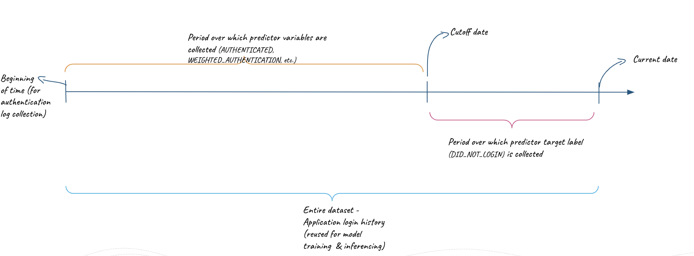

# Overview

This tool is an adaptation of a subset of features from an internal fully-native Snowflake application called 'SnowPatrol'.

Snowflake's CIO organization actively uses SnowPatrol to manage costs related to various in-house SaaS applications across departments. This is saving actual $$$ annually. Hear what Snowflake's CIO has to say about it : [Solution to optimize Software License ](https://www.youtube.com/watch?v=ys-zI5cRs6c)

While the full arc of SnowPatrol in-production within Snowflake IT covers many capabilities like auto-provisioning of most popular applications based on persona (learned through Snowpark ML model), understanding license usage to consider for revocation  and re-allocation (also learnt through Snowpark ML models), this tool provides one capability from this set, that of license revocation recommendations based on active usage.

The entire pipeline is fully native to Snowflake ans uses cutting edge features like **Snowpark for AI/ML**, **Streamlit (OSS)**, **Schema Evolution for CSVs** and others.


# Revocation Recommendations

License usage is learnt from the 1st party data - user authentication logs from sources such as Okta and/or directly from SaaS apps.

A ML model (Logistic Regression) is trained on this data alongwith metadata like employee department, division, title attributes, work day schedule (to take into account working days and holidays for actual usage calculation). <br/>

The model is then used to predict the probability of near-future logins which becomes the basis of recommending license revocations.

## Model training

The basis of understanding the login pattern of users are the authentication logs captured from various sources. Within Snowflake this comes from the tracked applications directly as well as Okta for a subset of them. Therefore this MVP also uses the same simulated data.

The way the combined authentication logs from both the sources are split to extract predictor and predicted features can be summed up as:

insert_img(feature_engineering.png, Feature Engineering from application's authentication logs)

This Streamlit app will allow the user to adjust the **_Cutoff date_** and the **_Probabilty threshold_** before training a new model over the data.

- **_Cutoff date_** is always in comparison to the current date when the training is being run. This dates help to split the source datasets into two logical groups - (1) The logins before cutoff which are used to calculate predictor variables such as _weighted_authentication_ etc., (2) The logins after cutoff which are used to calculate the predicted variable such as _did_not_login_.
_did_not_login_ is an indicator whether the user made a repeat login to the app with a period of 30days after the supposed _cutoff date_.
:red[NOTE!] - the sample data supplied with this app has the maximum login date of June/8 and therefore the **_cutoff date_** has to be set for more than 45days atleast in order to select a point-of-reference within logs that gives enough 'logins after' to create the predicted variables.

- **_Probability threshold_** is between 0 - 1 and represents an appetite for tolerance of the predicted probability of a repeat login based on the pattern learnt through training. A higher threshold would result in more revocation recommendation numbers, while a lower threshold would mean less number of such recommendations.

## Model runs

The revocation models are trained one at a time for each application which can be selected from a drop-down.

This app provides two options to get the recommendations:

- Pull data from a previous run. For this you will need to select a 'run-id' of any previous execution for that app.

- Generate fresh recommendations on that day by re-training the model on the data from sources (pre-configured through a pipeline beforehand).


## Project Pre-requisites
The following need to be installed on your local dev machines prior to getting started on the setup & demo:
1. Conda
2. Notebook
3. Git

The project uses Python3.11 and Snowpark 1.4.0 versions.

## Components

The repo organizes the code into multiple folders:
1. appUtil/creds.json : Contains Snowflake connection parameters. You should edit this file before running the main [notebook](appUtil/License_Revocation_Notebook.ipynb).

2. data : Contains source data required for this application.
    There's both real data with obfuscated PII that you can use (../obfuscated) or simulated data (../generated) while preparing for the test run of this application in your Snowflake environment.

3. appPages : Contains streamlit page source code.
4. appUtil : Contains the Python modules/notebook
5. img : Contains any images for streamlit to reference inside the application


## Setup

1. Clone this git repo on your local machine:

    > ``` git@github.com:snowflakecorp/user-license-rationalization.git```

2. Create new **Conda** environment for local development:


    > ```conda env create -f environment.yml```
    >
    > ```conda activate licensing```


   Or, update environment after editing environment.yml to add/remove packages:
   > ```conda env update --file environment.yml --prune``` <br/>

3. Deploying Snowflake objects:

    - Update the connection parameters in [creds.json](appUtil/creds.json) for the Snowflake account where you would like to deploy this application's objects (Database, Schema, Stages, Source Tables, etc.)
    - Update the connection parameters in [secrets.toml](.streamlit/exammple_secrets.toml). You can use the example_secrets.toml file example and rename to secrets.toml

    - Go to [contants.py](appUtil/constants.py) to change the default names for the Snowflake objects that will be created.
      NOTE that the table schema assumed by the main training procedure and UI is per the data samples provided. You might need to change
      the column names if you plan to use your own source data.

    - Open the [License_Revocation_Notebook.ipynb](appUtil/License_Revocation_Notebook.ipynb) notebook, and run all the cells.

        There is a cell at the bottom through which you can test the train/revocation recommendation procedure by triggering locally.

    - Verify that the objects have been created in the configured database/schema in the designated Snowflake account.

4. Launching the application UI:

    - This repo ships with sample data (obfuscated for PII protection) that you can use to test the LR model that provides the revocation recommendations.

    - To interact with the app, start the streamlit UI page as (once the conda env has been activated):
    > ```streamlit run app.py```<br/>

    This should launch a new browser tab in your current active browser window with the landing page.


5. Generating revocation recommendations:

    - Connect with the designated Snowflake account by filling in the account identifier and the username/password.

    - Select the execution context - the role that owns the target database where application's artifacts are deployed, the database , schema, and warehouse name.

    - The revocation recommendations take a few input parameters as:

        

        - Cutoff Days: How far back do you wish to go to pull login history for training?
        - Revocation probability threshold

      Default values are set for these options, but you may want to set these based on the data you're using.
      With the sample data in this repo, the maximum login date recorded for both the apps is June/8/2023 and hence the 'cutoff_date' parameter would need be more than the default 30 days from the current date dependening on when you are running this application.

## How to install via SiS (Streamlit in Snowflake)
1. Run the SiS installation at the bottom of the [License_Revocation_Notebook.ipynb](appUtil/License_Revocation_Notebook.ipynb) notebook
2. You should see the streamlit app inside snowsight under Projects-->Streamlit-->Then by clicking on Licensing App
